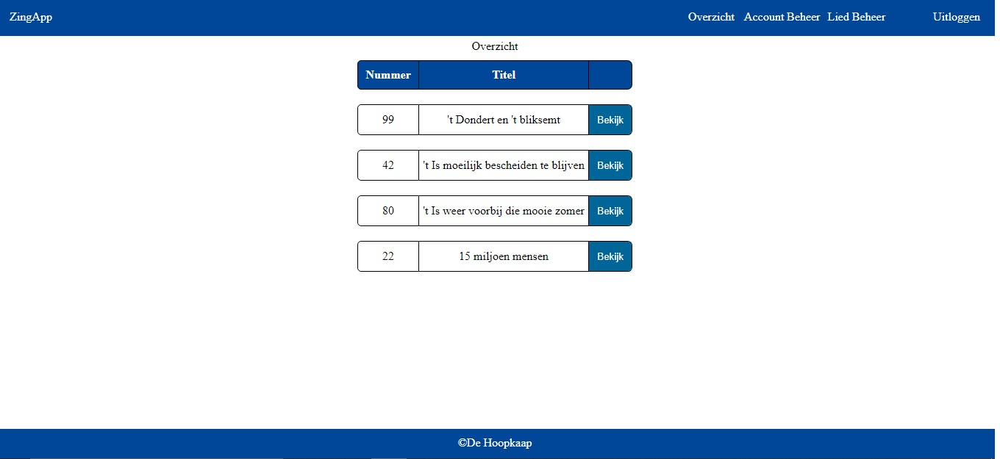

# Inleiding

De huidige app heeft als doel liedteksten makkelijk kunnen vinden en bekijken Hiervoor is een duidelijk overzicht belangrijk.

Ook moet de applicatie makkelijk beheerbaar zijn dus moet er via de app liedjes en accounts toegevoegd kunnen worden. hiervoor heeft de administrator toegang tot 2 extra pagina's in de navigatie via waar ze liedjes en account kunnen beheren.

Uiteraard mag de content alleen beschikbaar zijn voor leden hiervoor daarom moet je eerst door een loginpagina heen voordat je de rest van de content kan bekijken.

# Lijst benodigdheden
Om de productie versie van deze app te kunnen runnen heb je de volgende de zaken nodig.
1. De source code
2. Een github account
3. nodejs
4. github app (of andere manier om git te gebruiken)

# Installatie instructie
1. Je zet de sourcecode in een map naar keuze.
2. run het commando npm update om de benodigde packages binnen te halen.
3. hierna run het commando npm build om de buildmap aan te maken.
4. Maak een nieuwe publieke repository aan op github en zet hier de inhoud van de buildmap in.
5. ga naar je repository op github.com dan naar settings en scroll omlaag naar de kop github-pages en selecteer hier de main branch en de root folder.
6. als alles gelukt is kan staat nu het project live op https://{jou github Username}.github.io/{jou github repository}

# Inlog gegevens
Er zijn 2 accounts beschikbaar voor het nakijken. info staat hieronder. Het administrator account kan meerdere accounts aanmaken. het wordt sterk aangeraden om voor het testen van de wijzigings opties eerst een nieuw backup admin accountje te maken.

Ook gelieve informatie van de 2 standaard accounts niet wijzigingen of nadat je klaar bent na de informatie hieronder te resetten. Dit vraag ik omdat de informatie gewijzigd wordt in de database met aangehechte api en anders mogelijk de docent of externe examinator niet meer in kan loggen.

adminAccount => {
    naam: novi-admin
    wachtwoord: novi-frontend
}

userAccount => {
    naam: novi-user
    wachtwoord: novi-frontend
}

# beschikbare npm commandos
`npm start` hiermee kan je de development server starten
`npm run build` hiermee kan je de productie site build maken in de build folder.
